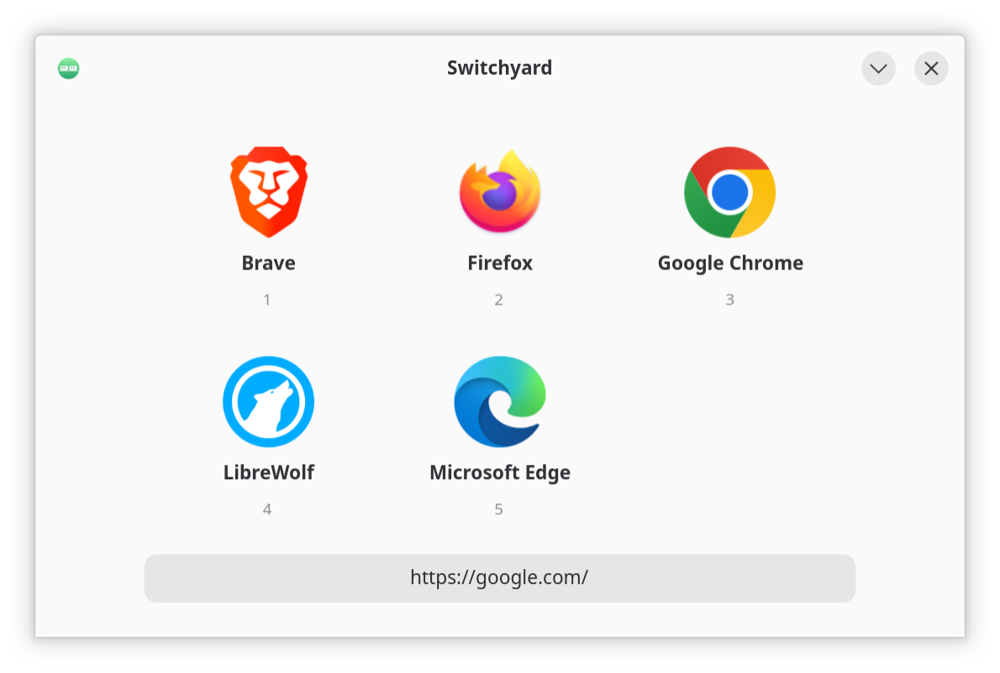
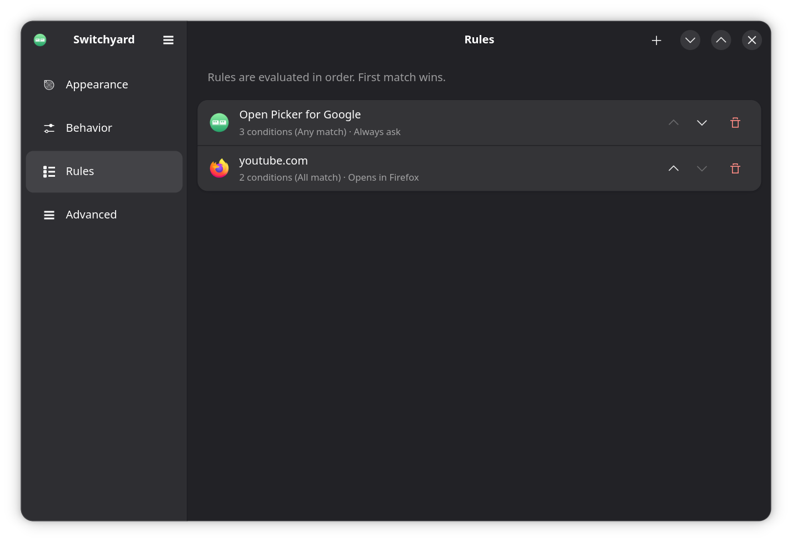
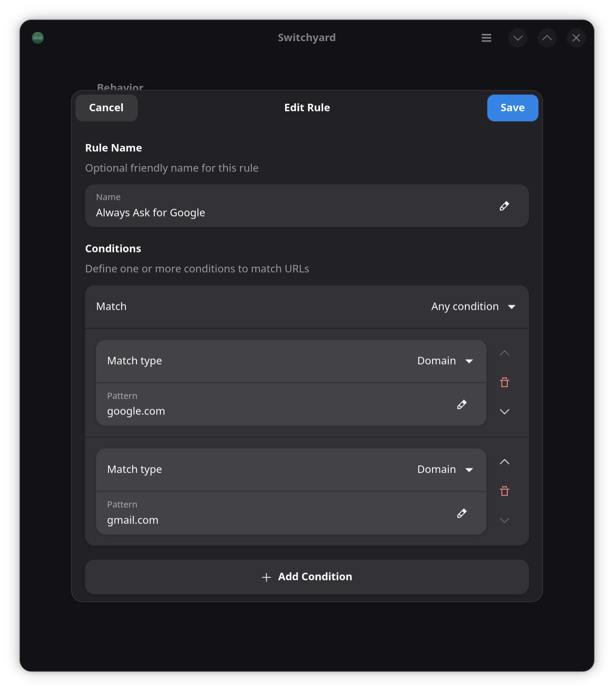

# Switchyard

[](https://github.com/alyraffauf/switchyard/actions/workflows/ci.yml)

**A rules-based URL router for Linux.** When you click a link, Switchyard automatically opens it in the right browser based on your rules, or shows a quick picker to let you choose.

<p align="center">
  
</p>

<p align="center">
  
</p>

<p align="center">
  
</p>

## Why Switchyard?

Like a railroad switchyard directing trains to different tracks, Switchyard routes URLs to the appropriate browser based on your rules. Work links go to your work browser, personal sites to another, and you can manually choose when needed.

## Features

- **Rule-based routing**: Automatically open URLs in specific browsers based on powerful patterns.
- **Multi-condition rules**: Combine multiple conditions with AND/OR logic for precise control.
- **Multiple pattern types**: Exact Domain, URL Contains, Wildcard, and Regex matching.
- **Quick browser picker**: When no rule matches, choose from your installed browsers with keyboard or mouse.
- **Keyboard shortcuts**: Press Ctrl+1-9 to instantly select a browser.
- **Lightweight**: Runs only when needed, no background processes.
- **GTK4 + libadwaita**: Native GNOME look and feel.

## Installation

### Flatpak (Recommended)

Requires [just](https://github.com/casey/just) for building.

```bash
# Build and install (automatically installs Flatpak runtimes if needed)
just flatpak
```

### Building from Source

For non-Flatpak builds, requires Go 1.24+, GTK4/libadwaita development libraries, and [just](https://github.com/casey/just).

```bash
# Install dependencies (Fedora)
just install-deps

# Build
just build

# Install to /usr/local
sudo just install

# Or install to custom prefix
sudo PREFIX=/usr just install
```

### Set as Default Browser

After installation, set Switchyard as your default browser so it can route all clicked links:

```bash
xdg-settings set default-web-browser io.github.alyraffauf.Switchyard.desktop
```

Or use your desktop environment's graphical settings to set Switchyard as the default browser.

## Usage

```bash
# Open settings
flatpak run io.github.alyraffauf.Switchyard

# Open a URL (typically called automatically by the system)
flatpak run io.github.alyraffauf.Switchyard "https://example.com"

# Non-Flatpak
switchyard
switchyard "https://example.com"
```

### Keyboard Shortcuts

**In the picker:**
- `Ctrl+1-9` - Select browser by number
- `Escape` - Close picker

**In settings:**
- `Ctrl+Q` - Quit

## Configuration

Config file location: `~/.config/switchyard/config.toml` or `~/.var/app/io.github.alyraffauf.Switchyard/config/switchyard/config.toml` for Flatpak.

```toml
prompt_on_click = true
fallback_browser = ""
check_default_browser = true

# Simple rule with a single condition
[[rules]]
name = "Work GitHub"
browser = "firefox.desktop"

[[rules.conditions]]
type = "domain"
pattern = "github.com"

# Multi-condition rule with AND logic
[[rules]]
name = "Google Docs"
logic = "all"  # all conditions must match
browser = "google-chrome.desktop"

[[rules.conditions]]
type = "domain"
pattern = "docs.google.com"

[[rules.conditions]]
type = "keyword"
pattern = "edit"

# Multi-condition rule with OR logic
[[rules]]
name = "Video Sites"
logic = "any"  # any condition can match
browser = "brave-browser.desktop"

[[rules.conditions]]
type = "domain"
pattern = "youtube.com"

[[rules.conditions]]
type = "domain"
pattern = "vimeo.com"

[[rules.conditions]]
type = "domain"
pattern = "twitch.tv"

# Rule with always ask
[[rules]]
name = "Shopping Sites"
always_ask = true

[[rules.conditions]]
type = "keyword"
pattern = "amazon"
```

### Rule Options

| Field | Description |
|-------|-------------|
| `name` | Optional friendly name displayed in the UI |
| `conditions` | Array of conditions to match (see below) |
| `logic` | How to combine conditions: `all` (AND) or `any` (OR). Default: `all` |
| `browser` | Desktop file ID of the target browser |
| `always_ask` | If true, show browser picker instead of auto-opening (default: false) |

### Condition Options

| Field | Description |
|-------|-------------|
| `type` | Match type: `domain`, `keyword`, `glob`, or `regex` |
| `pattern` | The pattern to match against |

### Condition Types

| Type | Description | Example |
|------|-------------|---------|
| `domain` | Exact Domain - matches specific hostname | `github.com` |
| `keyword` | URL Contains - matches if URL contains text | `youtube.com/watch` |
| `glob` | Wildcard - pattern with * wildcards | `*.github.com` |
| `regex` | Regex - regular expression matching | `^https://.*\.example\.(com\|org)` |

### Logic Modes

- **`all`** (AND logic): All conditions in the rule must match for the rule to apply
- **`any`** (OR logic): Any single condition matching will trigger the rule

Use `all` for precise targeting (e.g., "docs.google.com AND contains 'edit'") and `any` for broad matching (e.g., "youtube.com OR vimeo.com OR twitch.tv").

### Settings

| Setting | Description |
|---------|-------------|
| `prompt_on_click` | Show picker when no rule matches (default: true) |
| `fallback_browser` | Default browser to use when picker is disabled and no rule matches |
| `check_default_browser` | Prompt to set Switchyard as system default browser on startup (default: true) |

## Development

### Running Tests

The project includes unit tests for the core rule matching logic. Tests can run without GTK dependencies.

```bash
# Run tests
just test

# Run tests with coverage report
just test-coverage

# View HTML coverage report
go tool cover -html=coverage.out
```

Tests are automatically run in CI on every push and pull request.

## Prior Art

Switchyard draws inspiration from other excellent URL routers and browser pickers:

- **[Choosy](https://choosy.app/)** - The gold standard URL router for macOS with beautiful UI and powerful rule-based routing.
- **[Junction](https://github.com/sonnyp/Junction)** - Elegant browser picker for Linux with a modern interface.

Switchyard combines the best of both: powerful rule-based routing with a fast, native Linux experience built on GTK4 and libadwaita.

## License

[GPL-3.0-or-later](LICENSE.md)
