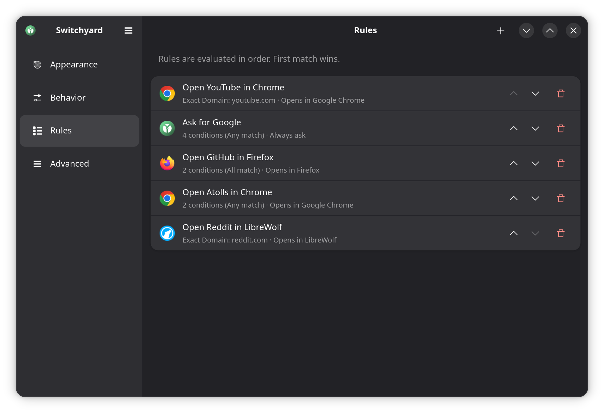
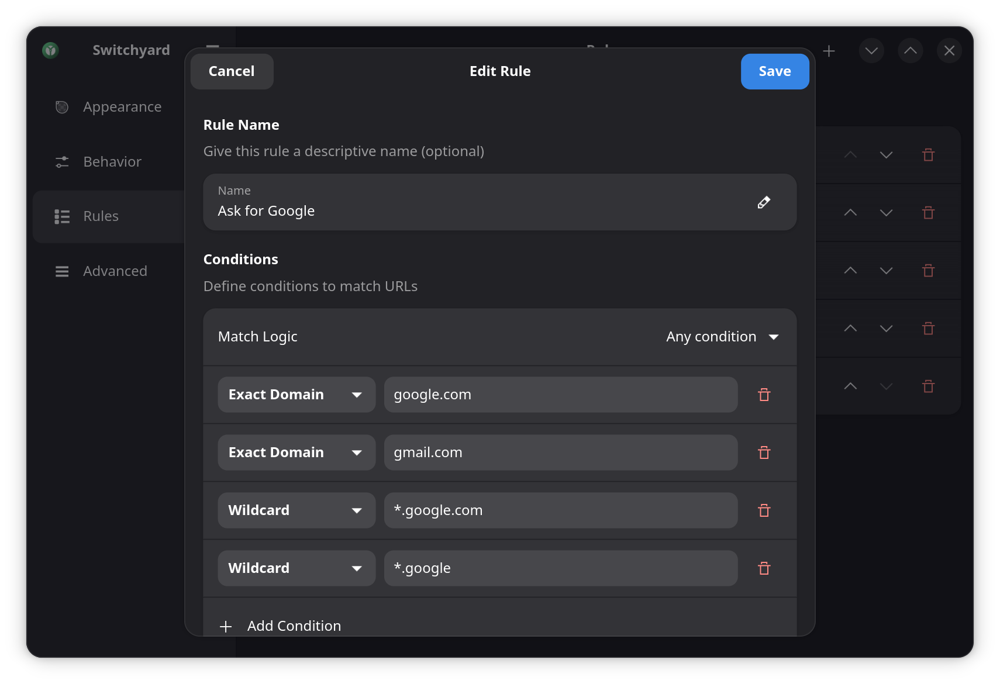

<h1>
  
  Switchyard
</h1>

<br clear="left"/>

**A rules-based URL router for Linux.**

Set up smart, automatic routing. Or choose your browser on the fly.

[](https://github.com/alyraffauf/switchyard/actions/workflows/ci.yml)

<p align="center">
  
</p>

<p align="center">
  
</p>

<p align="center">
  
</p>

## Why Switchyard?

Like a railroad switchyard directing trains to different tracks, Switchyard routes URLs to the appropriate browser based on your rules. Work links go to your work browser, personal sites to another, and you can manually choose when needed.

## Features

- **Rule-based routing**: Automatically open URLs in specific browsers based on powerful patterns.
- **Multi-condition rules**: Combine multiple conditions with AND/OR logic for precise control.
- **Multiple pattern types**: Exact Domain, URL Contains, Wildcard, and Regex matching.
- **Custom URI scheme**: Create links that specify browser preferences directly with `switchyard://` URLs.
- **Quick browser picker**: When no rule matches, choose from your installed browsers with keyboard or mouse.
- **Keyboard shortcuts**: Press Ctrl+1-9 to instantly select a browser.
- **Lightweight**: Runs only when needed, no background processes.
- **GTK4 + libadwaita**: Native GNOME look and feel.

## Installation

### Flatpak (Recommended)

Requires [just](https://github.com/casey/just) for building.

```bash
# Build and install (automatically installs Flatpak runtimes if needed)
just flatpak
```

### Nix Flake

A flake is provided for NixOS or Nix users. It also supplies a devShell and a formatter.

Add this repository to your flake inputs:

```nix
{
  inputs.switchyard.url = "github:alyraffauf/switchyard";
}
```

Then, add this to your NixOS configuration:

```nix
# Add to your NixOS configuration
{
  environment.systemPackages = [
    inputs.switchyard.packages.${system}.default
  ];
}
```

### Building from Source

For non-Flatpak builds, requires Go 1.24+, GTK4/libadwaita development libraries, and [just](https://github.com/casey/just).

```bash
# Install dependencies (Fedora)
just install-deps

# Build
just build

# Install to /usr/local
sudo just install

# Or install to custom prefix
sudo PREFIX=/usr just install
```

### Set as Default Browser

After installation, set Switchyard as your default browser so it can route all clicked links:

```bash
xdg-settings set default-web-browser io.github.alyraffauf.Switchyard.desktop
```

Or use your desktop environment's graphical settings to set Switchyard as the default browser.

## Usage

```bash
# Open settings
flatpak run io.github.alyraffauf.Switchyard

# Open a URL (typically called automatically by the system)
flatpak run io.github.alyraffauf.Switchyard "https://example.com"

# Non-Flatpak
switchyard
switchyard "https://example.com"
```

### Keyboard Shortcuts

**In the picker:**

- `Ctrl+1-9` - Select browser by number
- `Escape` - Close picker

**In settings:**

- `Ctrl+Q` - Quit

## Documentation

- [Configuration](docs/Configuration.md) - Config file format, rules, and settings.
- [URI Scheme](docs/URI%20Scheme.md) - Custom `switchyard://` URLs for specifying browser preferences.

## Development

### Running Tests

The project includes unit tests for the core rule matching logic. Tests can run without GTK dependencies.

```bash
# Run tests
just test

# Run tests with coverage report
just test-coverage

# View HTML coverage report
go tool cover -html=coverage.out
```

Tests are automatically run in CI on every push and pull request.

## Prior Art

Switchyard draws inspiration from other excellent URL routers and browser pickers:

**Linux:**

- **[Junction](https://github.com/sonnyp/Junction)** - Elegant browser picker with a modern interface.
- **[Braus](https://braus.properlypurple.com/)** - GTK/Python browser picker for selecting browsers on each link click.

**macOS:**

- **[Choosy](https://choosy.app/)** - The gold standard URL router with beautiful UI and powerful rule-based routing.

**Windows:**

- **[BrowseRouter](https://github.com/nref/BrowseRouter)** - JSON-configured browser router for Windows 10/11.
- **[BrowserPicker](https://browserpicker.z13.web.core.windows.net/)** - Microsoft Store app for picking browsers and routing by URL patterns.

**Cross-platform:**

- **[Linklever](https://linklever.net/)** - Fast browser router with URL filtering available on Windows, macOS, and Linux.

Switchyard combines the best ideas from these tools: powerful rule-based routing with a fast, native Linux experience built on GTK4 and libadwaita.

## License

[GPL-3.0-or-later](LICENSE.md)
