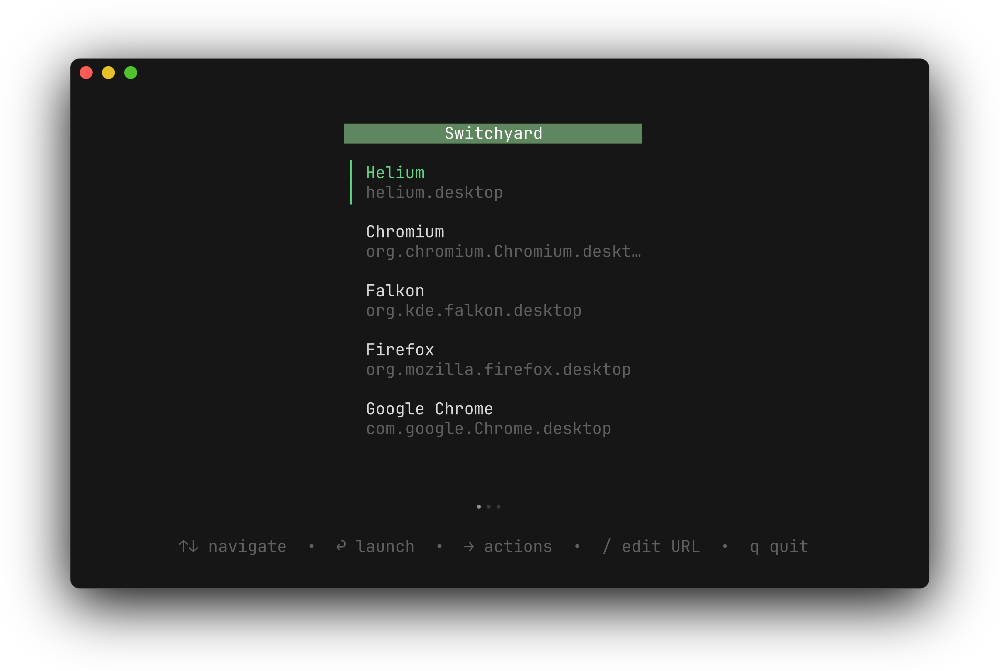

Switchyard has an experimental terminal user interface (TUI) available on both Linux and macOS. It works more or less as the Adwaita GUI does, but from your terminal, with the limtiations that entails.



The TUI was built for internal testing and porting to macOS, but is feature-complete and uses the same backend that the GUI does. You can use it to launch links, including `switchyard://` URLs, from your terminal or from a scripting language of your choice.

## Usage

Clone the [repo](https://github.com/alyraffauf/switchyard), then build the TUI binary from the `cmd/sw` directory:

```bash
go run ./cmd/sw
```

Or, just use Nix:

```bash
nix run .#sw
```

You may pass your URL as a command line argument:

```bash
sw https://switchyard.aly.codes
```
